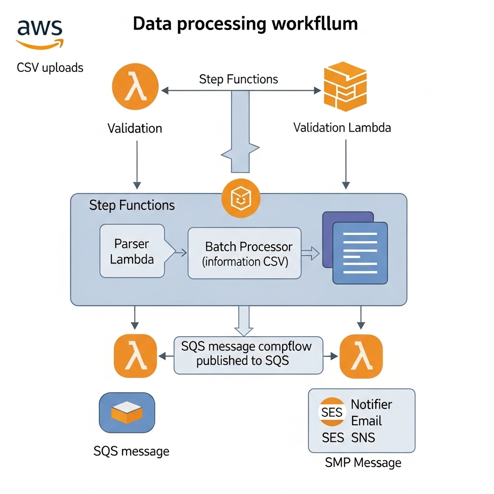

# 🎓 Exam Results Notification System

## Overview

The **Exam Results Notification System** is designed to process and send Exam results notifications via email and SMS. The system leverages an **Event-Driven Serverless Architecture** with microservices to ensure scalability, reliability, and fault tolerance.

### Architecture Overview

- **Workflow**:  
  CSV Upload → S3 Event → Validation Lambda → Step Functions → Parser Lambda → Batch Processor → SQS Queue 
  → Email Notifier → SES → Email Delivery
  → SMS Notifier   → SNS → SMS Delivery



### Design Patterns Applied

1. **Event-Driven Architecture**: S3 triggers Lambda functions for real-time processing.  
2. **Microservices**: Four independent Lambda functions for modular tasks.  
3. **CQRS**: Separate read/write paths for DynamoDB and SES.  
4. **Circuit Breaker**: SQS ensures fault tolerance.  
5. **Saga Pattern**: Step Functions orchestrate distributed transactions.  
6. **Infrastructure as Code**: Terraform for reproducible deployments.  

## 🔐 Security Best Practices

- **Encryption**: Use **KMS** for encrypting data at rest.  
- **Least Privilege**: IAM roles scoped to specific services.  
- **Network Isolation**: Lambda functions run within a **VPC** for enhanced security.  
- **Audit Trail**: CloudWatch logs for tracking all actions and events.  

## 📈 Scalability & Reliability

- **Auto-scaling**: Lambda automatically scales based on incoming traffic.  
- **Retry Logic**: SQS redelivery and Step Functions retries ensure reliability.  
- **Dead Letter Queue**: Ensures handling of failed messages.  
- **Monitoring**: CloudWatch metrics and alarms for system health.  

---

## 🚀 System Overview

### AWS Services and Components

- **S3**: For CSV file uploads triggering the process.  
- **Step Functions**: Orchestrates the entire workflow.  
- **Lambda Functions**: Responsible for parsing, validation, and sending notifications.  
- **DynamoDB**: Stores student records and email/SMS delivery status.  
- **SES/SNS**: Responsible for email and SMS delivery.  

## 📁 Project Structure

```
├── src/                      # Lambda function code  
│   ├── parser/              # CSV parsing Lambda  
│   ├── validation/          # S3 trigger validation  
│   ├── batch_processor/     # Batch processing Lambda  
│   ├── email_notifier/      # Email sending Lambda  
│   ├── sms_notifier/        # SMS sending Lambda  
│   └── common/              # Shared utilities  
├── terraform/                # Infrastructure as Code  
│   ├── environments/        # Environment configurations  
│   ├── modules/             # Reusable Terraform modules  
│   └── *.tf files           # Main Terraform configuration  
├── build_lambdas.sh          # Lambda packaging script  
└── *.csv files               # Sample data files  
```

---

## ⚡ Quick Start

### Prerequisites

- **AWS CLI** configured with appropriate credentials  
- **Terraform** installed  
- **Python 3.11+** for local development  

---

### 1. Environment Setup

#### Configure AWS CLI

```bash
aws configure
```

#### Set Environment Variables

```bash
export AWS_REGION=ap-southeast-2
```

---

### 2. Infrastructure Deployment

#### Step 1: Build Lambda Functions

```bash
# For development
ENV=dev bash build_lambdas.sh

# For production
ENV=prod bash build_lambdas.sh

# For staging
ENV=staging bash build_lambdas.sh
```

#### Step 2: Deploy Infrastructure

```bash
cd terraform

# Initialize Terraform
terraform init

# Plan deployment (development)
terraform plan -var-file="environments/dev.tfvars"

# Apply deployment (development)
terraform apply -var-file="environments/dev.tfvars"

# For production
terraform apply -var-file="environments/prod.tfvars"
```

---

### 3. Environment Configuration

Create or modify environment files in `terraform/environments/`:

**`dev.tfvars`**:
```hcl
env = "dev"
sender_email = "your-dev-email@example.com"
verified_phone_numbers = ["+614xxxxxxxx"]
```

**`prod.tfvars`**:
```hcl
env = "prod"
sender_email = "your-prod-email@example.com"
verified_phone_numbers = ["+614xxxxxxx6", "+6141xxxxxx78"]
```

---

## 📊 CSV Format

The CSV should follow this **headerless** format:

```csv
email@example.com,20000001,16,"2024 Exam Results:
Mathematics: 85 (Band 5)
English: 92 (Band 6)
ELIGIBLE FOR Exam",+61452025776
```

**Columns:**

- `email`: Verified SES email address  
- `student_id`: Unique student identifier  
- `extra_data`: Additional data (unused)  
- `results`: Exam results text  
- `phone`: E.164 format phone number (+614...)  

---

## 🔄 Usage Workflow

### 1. Upload CSV

```bash
aws s3 cp your_file.csv s3://exam-results-results-dev/uploads/ready-for-processing/
```

### 2. Monitor Processing

```bash
aws stepfunctions list-executions   --state-machine-arn arn:aws:states:ap-southeast-2:<account>:stateMachine:exam-results-processing-dev
```

### 3. Check Delivery Status

```bash
# Check DynamoDB records
aws dynamodb scan   --table-name exam-results-results-dev   --query 'Items[*].[student_id, email_status, sms_status]'   --output table

# Check CloudWatch logs
aws logs tail /aws/lambda/exam-results-email-notifier-dev --since 1h
aws logs tail /aws/lambda/exam-results-sms-notifier-dev --since 1h
```

---

## 🧰 Troubleshooting

### Common Issues

**Email Not Delivered**  
- Cause: Email not verified in SES  
- Fix: Add email to SES verified identities  

**SMS Not Delivered**  
- Cause: Phone number not registered in SNS sandbox  
- Fix: Register phone numbers via `verified_phone_numbers` variable  

**KMS Access Denied**  
- Cause: Missing IAM permissions  
- Fix: Ensure KMS permissions are correctly applied  

### Debug Commands

```bash
# Check Lambda status
aws lambda list-functions   --query 'Functions[?contains(FunctionName, `exam-results`)]'   --output table

# Check recent logs
aws logs tail /aws/lambda/exam-results-parser-dev --since 1h
```

---

## 📈 Monitoring

### CloudWatch Metrics

- **Lambda Errors**: Monitor Lambda function errors  
- **SES Bounces**: Track email delivery failures  
- **SNS Delivery**: Monitor SMS delivery rates  

### Alerts Setup

- Configure CloudWatch alarms for production monitoring  

---

## 🗑️ Cleanup

### Destroy Infrastructure

```bash
cd terraform
terraform destroy -var-file="environments/dev.tfvars"
```

### Remove S3 Objects

```bash
aws s3 rm s3://exam-results-results-dev --recursive
```

---

## ✅ Pre-Deployment Checklist

- [ ] AWS CLI configured  
- [ ] SES email verified  
- [ ] SNS phone numbers registered  
- [ ] Environment variables configured  
- [ ] Lambda functions built  
- [ ] Terraform state configured  
- [ ] IAM permissions verified