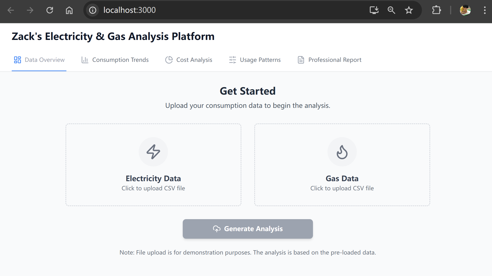
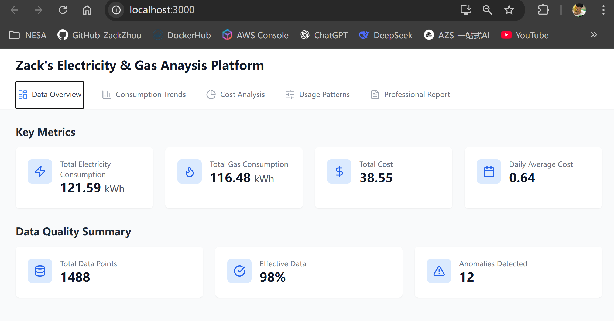
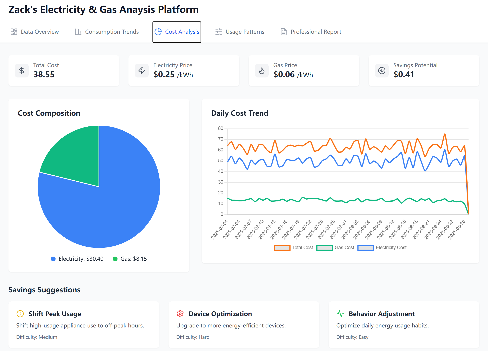
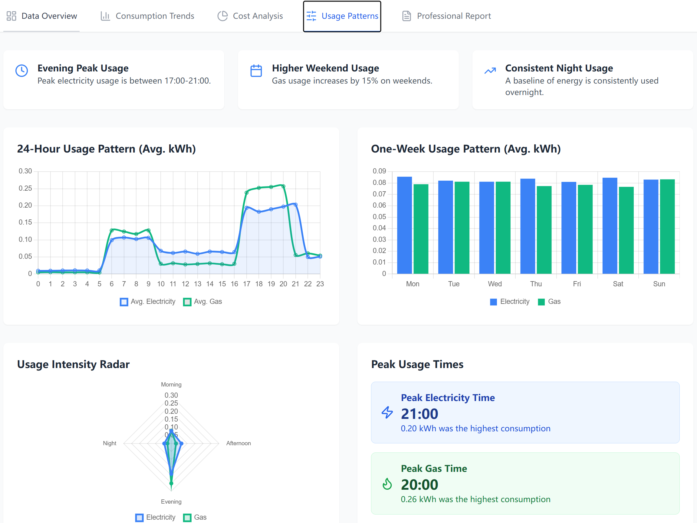
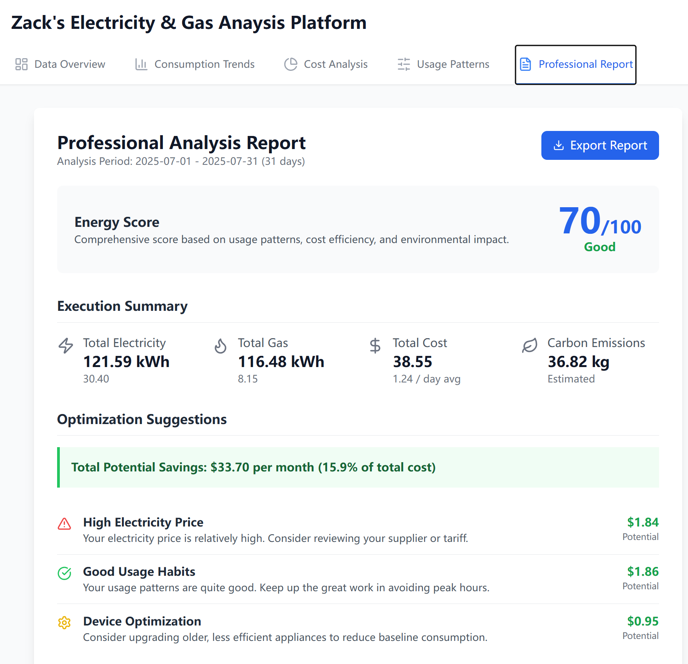

# Electricity & Gas Consumption Analysis Platform

This project is a web-based dashboard that analyzes and visualizes electricity and gas consumption data from CSV files. It processes historical data to uncover usage patterns, identify cost trends, and present the findings through an interactive interface. The application also generates a professional report with actionable insights and savings recommendations.

## Project Evolution

The project was initially planned as a standard data visualization tool. However, it underwent a significant modernization phase to enhance the user experience:

1.  **Initial Vision (`planning.md`):** The first phase outlined a project to analyze energy data and present it through a web interface using a standard stack.
2.  **Frontend Modernization (`new-plan.md` & `update-plan.md`):** To achieve a more polished and professional aesthetic, the frontend was completely refactored. The original Material-UI components were replaced with **Tailwind CSS** for styling and **Lucide React** for icons, resulting in a cleaner, more data-centric design that precisely matches the target visual samples.

## Technical Architecture

The application is composed of a Python backend for data processing and a React frontend for visualization.

### 1. Backend (`analyzer.py`)

The backend is a Python script responsible for the core data analysis.

*   **Functionality:** It reads raw consumption data from `electricity_consumption_2months_patterned.csv` and `gas_consumption_2months_patterned.csv`.
*   **Processing:** Using the **Pandas** library, it cleans the data, calculates key metrics (e.g., total/average consumption, cost), analyzes trends (hourly, weekly), identifies usage patterns (peak times), and assesses potential savings.
*   **Output:** The script's final output is a single `analysis_results.json` file, which serves as the data source for the frontend.

### 2. Frontend (`client/`)

The frontend is a single-page application built with React that provides a rich, interactive user experience.

*   **Framework:** **React** (bootstrapped with Create React App).
*   **Styling:** **Tailwind CSS** is used for utility-first styling, providing a custom and modern look.
*   **Charting:** **Chart.js** (via `react-chartjs-2`) is used to render all visualizations.
*   **Icons:** **Lucide React** provides clean and consistent icons throughout the dashboard.
*   **Functionality:** The application fetches the `analysis_results.json` file and renders the data across several specialized tabs.

## Key Features

The dashboard is organized into multiple views, each providing a different perspective on the energy data:

*   **Data Overview:** Displays high-level key metrics like total consumption, total cost, and data quality summaries.
*   **Consumption Trends:** Features bar charts for 24-hour and weekly consumption patterns, allowing users to identify when they use the most energy.
*   **Cost Analysis:** Includes a pie chart for the electricity vs. gas cost breakdown and a line chart showing daily cost trends over the entire period.
*   **Usage Patterns:** Provides deeper insights through a **Radar Chart** for usage intensity (Morning, Afternoon, Evening, Night) and highlights specific peak usage times for both electricity and gas.
*   **Professional Report:** A summary page that includes an overall "Energy Score," a summary of key figures, and actionable savings recommendations.

## How to Get Started

Follow these steps to run the application locally.

### Prerequisites

*   Python 3
*   Node.js and npm

### 1. Run the Backend Analysis

First, run the Python script to generate the data file for the frontend.

```bash
# Navigate to the project directory
cd mlops/electricity-gas-analytic

# Install Python dependencies
pip install -r requirements.txt

# Run the analysis script
python analyzer.py
```
This will create `analysis_results.json` in the root of the project folder and also copy it to the `client/public` directory.

### 2. Run the Frontend Application

Once the data is generated, you can start the React development server.

```bash
# Navigate to the client directory
cd client

# Install frontend dependencies
npm install

# Start the development server
npm start
```
This will open the application in your default web browser, typically at `http://localhost:3000`.

## Dashboard Screenshot






